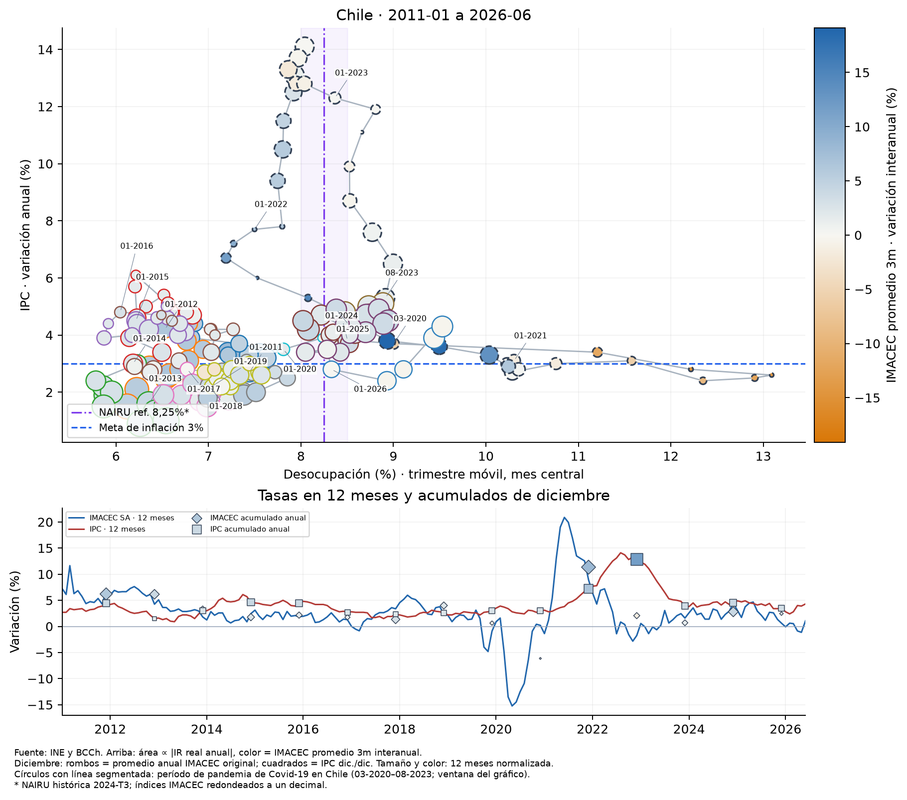

# Inflación empleo y actividad en Chile entre 2011 y 2026

Enero de 2011 a junio de 2026 | Análisis para LinkedIn

Ampliar el horizonte cambia la lectura de la curva de Phillips. En los 186 meses comunes, la correlación contemporánea entre inflación y desocupación es 0,124, una asociación positiva débil. En 2024–2026 era prácticamente nula. La comparación por períodos muestra que este promedio no describe una relación estable ni permite inferir causalidad.

La visualización conecta inflación, empleo, remuneraciones reales y actividad: desocupación en el eje horizontal, inflación anual en el vertical, magnitud del cambio anual del IR real en el área y crecimiento interanual del promedio móvil de tres meses del IMACEC en el color. Naranja indica caída de actividad, claro cercanía a cero y azul crecimiento. El panel inferior compara las variaciones en 12 meses del IMACEC desestacionalizado y del IPC e identifica los acumulados de diciembre.

Enero y extremos de la ventana Covid etiquetados MM-AAAA. Bordes segmentados: 03-2020–08-2023. Área proporcional al valor absoluto del IR real anual; su signo se consulta en el gráfico interactivo. Color del IMACEC con escala simétrica fija. ENE e IMACEC promedio 3m alineados al mes central. Referencias: inflación 3% y punto medio histórico NAIRU 8,25% [5–7].

## Lo que cambia al incorporar quince años de historia

En 2011-01, el punto inicial registra inflación de 2,7%, desocupación de 7,44% y aumento anual del IR real de 2,88%. En 2026-06, los valores son 4,3%, 9,53% y 3,27%. La comparación de extremos oculta episodios con dinámicas muy distintas.

La desocupación alcanza su máximo muestral de 13,09% en 2020-06, cuando la inflación es 2,6%. El máximo de inflación llega después: 14,1% en 2022-08, con desempleo de 8,04%. Esta separación temporal desaconseja interpretar la nube como un intercambio contemporáneo fijo.

## El promedio agregado no representa todos los períodos

Las correlaciones descriptivas por ventanas predefinidas son: 2011–2019: −0,172 (108 meses); 2020–2023: −0,628 (48 meses); 2024–2026: −0,011 (30 meses). El último período termina en junio de 2026. Estos cortes son una forma de comparar episodios; no son regímenes identificados econométricamente.

Que las tres correlaciones parciales sean negativas y la agregada positiva no es un error. La covariación total combina los movimientos dentro de cada período con las diferencias entre sus promedios. Por eso, mezclar episodios puede cambiar el signo de la asociación. No corresponde interpretar 0,124 como evidencia de que un aumento del desempleo cause más inflación, ni las correlaciones negativas como prueba causal de una curva de Phillips.

## La pregunta económica sigue abierta

La curva de Phillips vincula presiones inflacionarias con holgura, expectativas y otros determinantes. Una comparación útil requiere controlar oferta, precios externos, productividad y rezagos [4]. La muestra ampliada permite observar más episodios, pero su extensión no resuelve por sí sola la identificación. Las tasas anuales y los trimestres móviles comparten información entre observaciones; la inflación y el empleo también responden a fuerzas comunes.

## El salario real también puede retroceder

El IR real presenta caídas interanuales en 19 de 186 meses. Su mínimo es −2,85% en 2022-07 y su máximo 5,13% en 2013-04. La conclusión anterior de crecimiento en todos los meses solo era válida para 2024–2026. La ampliación revela pérdidas de poder adquisitivo que ese corte reciente no mostraba.

El área usa el valor absoluto: una caída salarial grande también produce una burbuja grande. El color representa actividad, no el signo del salario. El IR mide remuneraciones reales por hora en su cobertura y no equivale al ingreso total de los hogares ni incorpora el desempleo de la misma forma. Ya está deflactado por IPC: no debe descontarse nuevamente la inflación [3].

## Contracción rebote y efecto de base en la actividad

El crecimiento interanual del promedio móvil del IMACEC alcanza −15,01% en 2020-05 y 19,13% en 2021-06. Hay 29 meses con tasas negativas. El rebote interanual no debe confundirse con un cambio del nivel relativo a su potencial: crecer respecto de una base deprimida no equivale a estar por encima de una trayectoria potencial.

La escala simétrica conserva los extremos históricos, por lo que variaciones pequeñas aparecen próximas al tono claro. La barra lateral y el tooltip permiten distinguirlas de cero. El IMACEC mide actividad; no estima por sí solo una brecha de producto ni la NAIRU.

## Qué muestra el último punto

En 2026-06, el promedio móvil del IMACEC varía −0,30% interanual, mientras su nivel desestacionalizado es 113,8 y su cambio mensual 0,62%. La actividad trimestral móvil ligeramente inferior a la de un año antes coexiste con inflación de 4,3%, desocupación de 9,53% y crecimiento del IR real de 3,27%. Frecuencias distintas pueden dar señales diferentes; esta combinación no identifica automáticamente un shock ni prescribe una tasa de interés.

## Fechas cobertura y referencias

El IPC histórico tiene niveles desde diciembre de 2009, pero las tasas anuales publicadas y el IR real anual disponibles comienzan en enero de 2011. La intersección conserva 186 meses hasta junio de 2026. Junio usa ENE e IMACEC promedio de mayo–julio: requiere conocer julio y es retrospectivo. No se rellenan faltantes. El panel muestra IMACEC desestacionalizado e IPC en variación de 12 meses, hasta la misma fecha central.

La línea vertical de 8,25% es nuestro punto medio del rango 8,0–8,5% para 2024-T3, publicado en la minuta del IPoM de diciembre de 2024 mediante estimaciones Kalman multivariadas y VAR [5]. No es una NAIRU oficial de 2026 ni de cada año desde 2011. La banda refleja dispersión entre estimaciones, no un intervalo de confianza. La referencia usa desempleo desestacionalizado, a diferencia de los puntos. Las distancias son ilustrativas, no brechas oficiales. La meta de inflación del 3% se refiere al horizonte de dos años [6].

## Fórmulas utilizadas

Sean Iₜ el IMACEC original y Sₜ el desestacionalizado, ambos con promedio 2018=100. Promedio centrado: Īₜ = (Iₜ₋₁ + Iₜ + Iₜ₊₁) / 3. Color: gₜ = 100 × (Īₜ / Īₜ₋₁₂ − 1). Se comparan promedios de niveles, no promedios de tasas. Con alineación al mes final, la ventana es t−2, t−1 y t. Variación mensual: mₜ = 100 × (Sₜ / Sₜ₋₁ − 1); el panel representa aₜ = 100 × (Sₜ / Sₜ₋₁₂ − 1), junto con πₜ.

Desocupación: uₜ = 100 × desocupados / fuerza de trabajo. Inflación: πₜ = 100 × (IPCₜ / IPCₜ₋₁₂ − 1), usando la tasa publicada. IR real: rₜ = 100 × (IRᴿₜ / IRᴿₜ₋₁₂ − 1). Área: Aₜ = k × |rₜ|. Color: L = máximo de |gₜ| en la muestra (mínimo 0,1); zₜ = (gₜ + L) / (2L). Naranja en −L, claro en 0 y azul en +L; escala fija en todos los fotogramas.

Referencia vertical: u* = (8,0 + 8,5) / 2 = 8,25%. Distancias: uₜ − u* y πₜ − 3, en puntos porcentuales. Correlación de Pearson: ρ = Σ[(uₜ − ū)(πₜ − π̄)] / √{Σ(uₜ − ū)² × Σ(πₜ − π̄)²}. Las medias corresponden a cada ventana; la muestra completa tiene 186 observaciones. No se presentan pruebas de significancia ni una estimación causal.

Las tasas IMACEC se calculan con índices BDE publicados con un decimal y son aproximadas; las fuentes pueden revisarse [7]. El resumen numérico y las correlaciones se exportan con el cuaderno. El informe toma sus cifras de ese resumen para evitar diferencias entre tablas, gráficos y texto.

## Cómo leer los cierres anuales y las fechas destacadas

El gráfico de Phillips identifica cada enero con MM-AAAA y añade 03-2020 y 08-2023. Fuera de la pandemia, el color del borde distingue cada año. Los círculos de marzo de 2020 a agosto de 2023 llevan borde segmentado: es la ventana de pandemia Covid-19 en Chile adoptada para esta visualización. Permite localizar esos meses sin atribuir todos sus cambios a una sola causa. No equivale a una estimación de los efectos de la pandemia ni a las fechas completas de vigencia legal de la alerta sanitaria, que terminó el 31 de agosto de 2023 [8].

El panel inferior compara dos tasas mensuales a 12 meses: IMACEC desestacionalizado en azul e IPC en rojo. El IMACEC del color de Phillips sigue siendo la variación anual de su promedio móvil de tres meses original; es una medida distinta. El cursor temporal mantiene sincronizados ambos paneles.

En diciembre se agregan rombos para el crecimiento del promedio anual del IMACEC original y cuadrados para la inflación acumulada diciembre contra diciembre. El rombo puede quedar fuera de la línea azul porque compara promedios anuales originales, mientras la línea compara niveles mensuales desestacionalizados. No se suman las tasas mensuales ni las tasas interanuales.

En 2025, el acumulado del IMACEC original es aproximadamente 2,45%, mientras su tasa desestacionalizada a 12 meses de diciembre es 0,62%. La inflación de cierre es 3,5%. En junio de 2026, las tasas a 12 meses son 1,07% para IMACEC desestacionalizado y 4,3% para IPC. El contraste describe trayectorias de actividad y precios, sin establecer causalidad.

## Acumulados y normalización de los puntos

Para un año Y completo: Gᵞ = 100 × [(Σ Iᵞₘ / 12) / (Σ Iᵞ⁻¹ₘ / 12) − 1], con m de enero a diciembre. El acumulado del IPC es Pᵞ = 100 × (IPCᵞ_diciembre / IPCᵞ⁻¹_diciembre − 1); se usa la tasa anual publicada de diciembre para evitar diferencias de redondeo. No se dibuja un cierre de 2026 porque la muestra termina en junio.

Se usa una normalización común a ambas series y fija en toda la muestra: L = máximo de |aₜ| y |πₜ| (mínimo 0,1). Para cada punto de diciembre, nₜ = tasa a 12 meses / L. Su área es k × |nₜ| y su color se ubica entre naranja en −1, claro en 0 y azul en +1. La posición vertical muestra el acumulado; tamaño y color muestran la tasa a 12 meses. Un valor nulo tiene área nula. La forma distingue las series y el tooltip muestra ambas tasas.

Estas escalas no se recalculan en cada fotograma. Así, una burbuja no cambia de significado al reproducir o retroceder. Los archivos de esta edición usan el prefijo 20260924_19_42 y el orquestador registra las etapas y resultados de la ejecución.

## Fuentes y reproducibilidad

[1] INE. Encuesta Nacional de Empleo, series vigentes. https://www.ine.gob.cl/estadisticas-por-tema/mercado-laboral/ocupacion-y-desocupacion

[2] INE. IPC histórico empalmado, diciembre de 2009 a la fecha, base 2023. Variación anual publicada desde enero de 2011. URL exacta en extractors/ipc_extractor.py. https://www.ine.gob.cl/estadisticas-por-tema/precios-e-inflacion/indice-de-precios-al-consumidor

[3] INE. Índices de Remuneraciones y Costos Laborales; serie empalmada del IR real. https://www.ine.gob.cl/estadisticas-por-tema/mercado-laboral/remuneraciones-y-costos-laborales

[4] Banco Central de Chile. IPoM, junio de 2016, recuadro sobre evidencia de la curva de Phillips para Chile. https://www.bcentral.cl/documents/33528/133297/bcch_archivo_164644_es.pdf/5c004bf3-b159-1ff4-78aa-b286738295b6

[5] Banco Central de Chile. Minutas citadas en el IPoM diciembre de 2024. Holguras en el mercado laboral, secciones 1 y 4, páginas 34 y 38 del PDF. https://www.bcentral.cl/documents/33528/6735463/Minutas%2Bcitadas%2Ben%2Bel%2BIPoM%2Bdiciembre%2B2024.pdf/d24985ae-cb5e-2f03-4499-ecfad3d86ade

[6] Banco Central de Chile. IPoM junio de 2026. La meta de inflación y la Tasa de Política Monetaria, página 3 del PDF. https://www.bcentral.cl/documents/33528/8413153/IPoM%2Bjunio%2B2026.pdf/93388589-0929-4ad6-b166-10981ca34946

[7] Banco Central de Chile. BDE, IMACEC empalmado original y desestacionalizado, índices 2018=100. Series F032.IMC.IND.Z.Z.EP18.Z.Z.0.M y F032.IMC.IND.Z.Z.EP18.Z.Z.1.M. Actualización BDE 1 de septiembre de 2026; descarga 23 de septiembre de 2026. https://www.bcentral.cl/areas/estadisticas/imacec

Cálculos propios con los CSV locales del INE y del BCCh. IPC histórico empalmado incorporado en septiembre de 2026; fechas, cobertura y hashes en resultados. Código y datos: https://github.com/alejandrohenriquezr/curva_phillips

[8] Gobierno de Chile. Fin de alerta sanitaria por Covid-19 y enfermedades respiratorias, 31 de agosto de 2023. https://www.gob.cl/noticias/fin-alerta-sanitaria-covid-19-coronavirus-enfermedades-respiratorias-mascarillas-teletrabajo/
