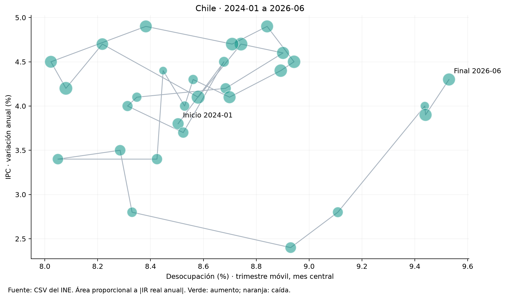

# Inflación y empleo en Chile vistos a través de la curva de Phillips

Enero de 2024 a junio de 2026 | Análisis para LinkedIn

Entre enero de 2024 y junio de 2026, la relación contemporánea entre inflación y desocupación en esta muestra chilena fue prácticamente nula. La correlación de las 30 observaciones es −0,011. El resultado invita a mirar la trayectoria de ambas variables y las remuneraciones reales, sin convertir una asociación estadística de corto plazo en una conclusión causal.

El gráfico animado permite hacerlo: la desocupación ocupa el eje horizontal, la inflación anual del IPC el vertical y el área de cada burbuja representa la magnitud de la variación anual del índice de remuneraciones real. El rastro conserva el recorrido. En la muestra, todas las variaciones del IR real son positivas y, por eso, las burbujas aparecen en verde.

Cada punto combina el IPC y el IR real del mes con la ENE del trimestre móvil centrado en ese mes. El tamaño representa el valor absoluto de la variación anual del IR real; el gráfico interactivo distingue las caídas en naranja.

## Una trayectoria que cambia de dirección

El punto inicial combina una inflación anual de 3,8%, una desocupación de 8,50% y un aumento anual del IR real de 2,78%. En junio de 2026, el punto final registra 4,3%, 9,53% y 3,27%, respectivamente. Entre los extremos, la desocupación aumenta 1,03 puntos porcentuales y la inflación 0,5 puntos. Sin embargo, esa comparación omite los cambios de dirección que aparecen durante el recorrido.

En febrero de 2026, la inflación anual baja a 2,4%, mientras la desocupación se ubica en 8,93%. En junio, ambas variables son mayores: 4,3% y 9,53%. Este desplazamiento hacia arriba y hacia la derecha no encaja con una lectura mecánica según la cual más desempleo siempre debe coincidir con menos inflación. Es una descripción de cuatro meses, no una identificación del shock que los explica.

## Qué puede decir una curva de Phillips

La intuición económica de la curva de Phillips relaciona las presiones inflacionarias con la holgura de la economía. Un mercado laboral más estrecho puede aumentar las presiones salariales y de costos. Pero la inflación observada también responde a expectativas, precios importados, tipo de cambio, productividad y perturbaciones de oferta. El análisis del Banco Central sobre la evidencia chilena subraya la necesidad de una especificación más amplia que una nube de inflación y desempleo [4].

Por eso, la correlación cercana a cero no demuestra que esa relación económica haya desaparecido. Puede reflejar fuerzas que operan al mismo tiempo, rezagos, cambios de expectativas o una muestra demasiado breve. Tampoco permite estimar la tasa de desempleo compatible con inflación estable ni atribuir el movimiento a una decisión específica de política monetaria.

## El salario real agrega una dimensión relevante

El IR real crece en términos anuales en los 30 meses comunes, con variaciones entre 1,40% y 3,74%. En junio de 2026, el aumento de 3,27% convive con una desocupación elevada respecto del comienzo de la muestra. Esta coexistencia recuerda que el poder adquisitivo de la remuneración por hora y la posibilidad de acceder a un empleo son dimensiones distintas del bienestar laboral.

El indicador del INE mide remuneraciones reales por hora en su ámbito de cobertura. No equivale al ingreso laboral total de los hogares: no incorpora del mismo modo el desempleo, los cambios de horas trabajadas o todas las formas de ocupación. Además, el IR real utiliza el IPC como deflactor. No es una tercera variable estadísticamente independiente de la inflación y no debe volver a descontársele el IPC [3].

## Leer el gráfico con sus límites

La ENE entrega trimestres móviles que comparten dos meses entre observaciones consecutivas. Aquí se utiliza el mes central, respetando la convención de los archivos: junio de 2026 corresponde a mayo–julio de 2026. El ejercicio es retrospectivo; ese punto no representa lo que se conocía en tiempo real durante junio. El cuaderno permite contrastar la asignación al mes final.

La muestra se limita a la intersección disponible de las tres series: 30 meses desde enero de 2024 hasta junio de 2026. Los archivos contienen IPC hasta agosto de 2026 e IR real hasta julio, pero no se completan los datos faltantes de empleo ni se prolonga artificialmente la animación. Tampoco se utilizan promedios de divisiones del IPC: se selecciona exclusivamente el IPC General y su variación anual publicada.

Las tasas no están desestacionalizadas y los cambios a doce meses comparten información entre períodos. Estas dependencias, junto con el reducido tamaño de la muestra, impiden tratar los puntos como observaciones independientes para una inferencia simple. Una investigación econométrica requeriría un horizonte más largo, expectativas de inflación, controles de oferta, rezagos y una estrategia explícita de identificación.

## Una herramienta para formular mejores preguntas

La animación sirve para identificar episodios, contrastar hipótesis y comunicar que inflación, empleo y poder adquisitivo no evolucionan de manera uniforme. La evidencia de este corte muestra que pueden coexistir remuneraciones reales crecientes, una tasa de desocupación mayor e inflación que cambia de dirección. Una evaluación de política económica necesita explicar esa combinación, no inferir una regla estable a partir de dos ejes.

¿Qué parte de estos movimientos corresponde a la demanda y cuál a costos, expectativas o cambios del mercado laboral? Esa es la pregunta que este gráfico ayuda a plantear y que un análisis posterior debería poner a prueba.

## Fuentes y reproducibilidad

[1] INE. Encuesta Nacional de Empleo, series vigentes. https://www.ine.gob.cl/estadisticas-por-tema/mercado-laboral/ocupacion-y-desocupacion

[2] INE. Índice de Precios al Consumidor. https://www.ine.gob.cl/estadisticas-por-tema/precios-e-inflacion/indice-de-precios-al-consumidor

[3] INE. Índices de Remuneraciones y Costos Laborales; serie empalmada del IR real. https://www.ine.gob.cl/estadisticas-por-tema/mercado-laboral/remuneraciones-y-costos-laborales

[4] Banco Central de Chile. IPoM, junio de 2016, recuadro sobre evidencia de la curva de Phillips para Chile. https://www.bcentral.cl/documents/33528/133297/bcch_archivo_164644_es.pdf/5c004bf3-b159-1ff4-78aa-b286738295b6

Cálculos propios con los CSV del INE incluidos en el proyecto. Corte de archivos recibido el 22 de septiembre de 2026. Código, datos y gráfico: https://github.com/alejandrohenriquezr/curva_phillips
